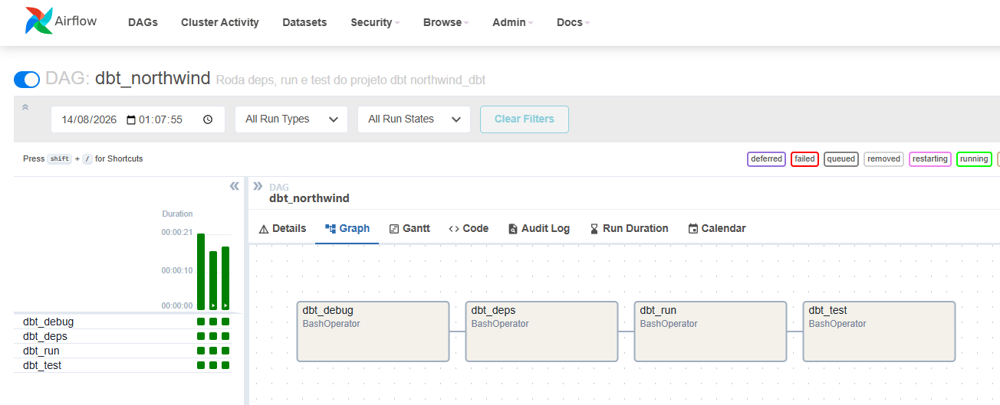
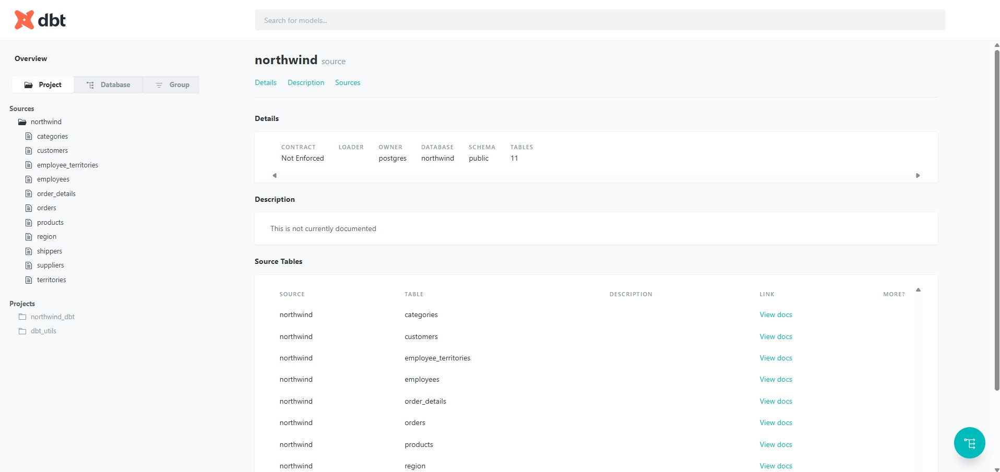
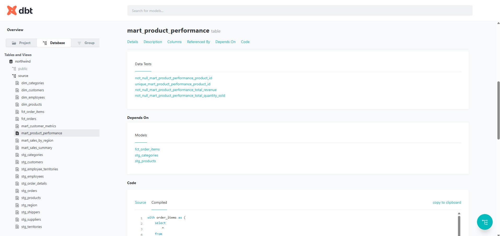
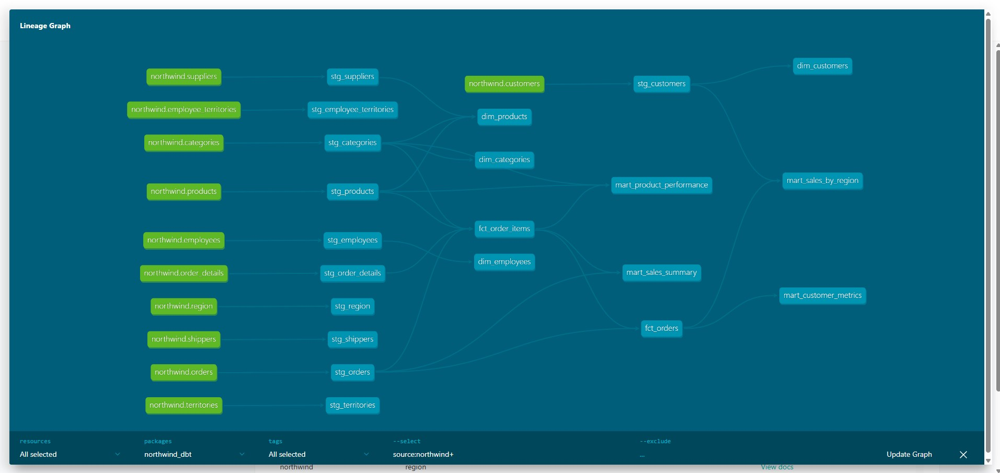
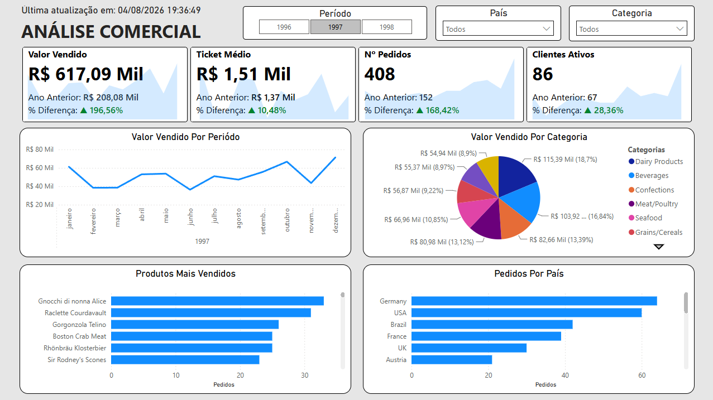

# 📊 Northwind ELT Pipeline

Pipeline de Engenharia de Dados (ELT) sobre o banco **Northwind**: transforma os dados brutos em três camadas modeladas com **dbt**, orquestradas pelo **Apache Airflow**, tudo containerizado com Docker Compose.

**Stack**: PostgreSQL 18 · dbt-core 1.12 · Apache Airflow 2.9.3 · Docker Compose

---

## 🏗️ Arquitetura

### Infraestrutura (4 containers)

```
┌──────────────────────────────────────────────────────────────┐
│                      rede "northwind"                        │
│                                                              │
│   db                            airflow-db                   │
│   PostgreSQL 18                 PostgreSQL 18                │
│   dados Northwind + modelos     metadados do Airflow         │
│        ▲                              ▲                      │
│        │ dbt lê e escreve             │ histórico de runs    │
│        │                              │                      │
│   ┌────┴──────────────────────────────┴────┐                │
│   │  airflow-scheduler                      │                │
│   │  executa as tasks → chama o dbt         │                │
│   ├─────────────────────────────────────────┤                │
│   │  airflow-webserver → UI :8080           │                │
│   └─────────────────────────────────────────┘                │
└──────────────────────────────────────────────────────────────┘
         ▲                                  ▲
    :5432 (dbt local, BI)             :8080 (navegador)
```

Os dois bancos são separados de propósito: `db` guarda os dados de negócio, `airflow-db` guarda apenas o controle interno do Airflow. O dbt roda num **venv isolado** (`/opt/dbt_venv`) dentro da imagem do Airflow, para não disputar dependências com ele.

### Fluxo dos dados

```
11 tabelas Northwind (schema public)
            │
            ▼
   STAGING (stg_*)  ·  11 modelos  ·  VIEW
   limpeza, snake_case, tipos, deduplicação
            │
            ▼
   ANALYTICS (fct_*, dim_*)  ·  6 modelos  ·  TABLE
   modelo dimensional: fatos e dimensões
            │
            ▼
   MARTS (mart_*)  ·  4 modelos  ·  TABLE
   KPIs agregados, prontos para BI
```

Total: **21 modelos** e **66 testes**. Todos materializados no schema `source` do banco `northwind`.

---

## 📚 Camadas

### 🔷 Staging (`stg_*`) — VIEW

Cópia limpa de cada tabela-fonte: renomeação para snake_case, correção de tipos, remoção de duplicatas e registros inválidos. Documentação e testes declarados em `models/staging/staging.yml`; fontes em `models/staging/sources.yml`.

Um modelo por tabela-fonte: `stg_orders`, `stg_order_details`, `stg_customers`, `stg_products`, `stg_employees`, `stg_categories`, `stg_suppliers`, `stg_territories`, `stg_employee_territories`, `stg_region`, `stg_shippers`.

### 🔶 Analytics (`fct_*`, `dim_*`) — TABLE

Modelo dimensional construído sobre o staging.

| Tipo | Modelos |
|---|---|
| Fatos | `fct_orders`, `fct_order_items` |
| Dimensões | `dim_customers`, `dim_products`, `dim_employees`, `dim_categories` |

As dimensões carregam a tag `dimensions`, permitindo `dbt run --select tag:dimensions`.

### 🟡 Marts (`mart_*`) — TABLE

Métricas finais, agregadas e otimizadas para consumo em BI:

- `mart_sales_summary` — resumo de vendas por período
- `mart_customer_metrics` — KPIs de clientes
- `mart_product_performance` — desempenho por produto
- `mart_sales_by_region` — vendas por região

---

## 🗂️ Tabelas-fonte

| Tabela | Descrição | Registros | Papel |
|--------|-----------|----------:|-------|
| **orders** | Pedidos realizados | 830 | Fato |
| **order_details** | Itens dos pedidos | 2.155 | Fato |
| **customers** | Clientes | 91 | Dimensão |
| **products** | Catálogo de produtos | 77 | Dimensão |
| **employees** | Funcionários | 9 | Dimensão |
| **categories** | Categorias de produtos | 8 | Dimensão |
| **suppliers** | Fornecedores | 29 | Dimensão |
| **territories** | Territórios de vendas | 53 | Dimensão |
| **employee_territories** | Vendedor ↔ território | 49 | Associação |
| **region** | Regiões | 4 | Dimensão |
| **shippers** | Transportadoras | 6 | Dimensão |

**Relacionamentos principais**
- `orders` → `customers`, `employees`, `shippers`
- `order_details` → `orders`, `products`
- `products` → `suppliers`, `categories`
- `employees` → `employee_territories` → `territories` → `region`

---

## 🚀 Como rodar

### Pré-requisitos

Docker e Docker Compose v2 (`docker compose`, sem hífen). Para desenvolvimento local do dbt, também Python 3.9+.

### Primeira execução

```bash
git clone <repo> && cd northwind_elt_pipeline

cp .env.example .env
# Edite o .env: preencha AIRFLOW_UID com o resultado de `id -u`
# e gere as duas chaves conforme os comentários do arquivo.

docker compose up -d --build
```

O `--build` constrói a imagem do Airflow com o dbt dentro — necessário só na primeira vez ou ao alterar `airflow/Dockerfile` / `airflow/requirements.txt`. O banco Northwind é populado automaticamente por `northwind.sql` na criação do volume.

### Nas próximas vezes

```bash
docker compose up -d
docker compose ps        # os 4 containers devem estar "healthy"
```

### Executando o pipeline pelo Airflow

1. Acesse **http://localhost:8080** — usuário `admin`, senha `admin` (definidos no `.env`)
2. Despause a DAG `dbt_northwind` no toggle à esquerda do nome
3. Clique em ▶ para disparar, ou aguarde o agendamento diário (**06:00**)
4. Acompanhe em **Graph** → clique numa task → **Logs**

A DAG (`airflow/dags/dbt_northwind.py`) executa em sequência: `dbt debug` → `dbt deps` → `dbt run` → `dbt test`. Se uma task falha, as seguintes não rodam.

Equivalente por linha de comando:

```bash
# dispara e deixa o scheduler executar
docker compose exec airflow-scheduler airflow dags trigger dbt_northwind

# ou roda a DAG inteira de forma síncrona, com a saída no terminal
docker compose exec airflow-scheduler airflow dags test dbt_northwind
```

Alterações no arquivo da DAG são recarregadas pelo scheduler em ~30s, sem rebuild.

### Desenvolvendo modelos localmente

Para o ciclo curto de escrever e testar um modelo, rodar o dbt direto na máquina é mais rápido que passar pelo Airflow. Requer apenas o container `db` de pé.

```bash
python -m venv venv
source venv/bin/activate          # Windows: venv\Scripts\activate
pip install -r airflow/requirements.txt

cd northwind_dbt
dbt debug                          # deve exibir "All checks passed!"
dbt deps
dbt run
dbt test
```

### Conexão do dbt

O `northwind_dbt/profiles.yml` é versionado com o projeto e resolvido por variáveis de ambiente, servindo aos dois contextos sem alteração:

| Contexto | `POSTGRES_HOST` |
|---|---|
| Máquina local (venv) | não definido → `localhost` |
| Dentro do Airflow | `db` (nome do serviço) |

Não é necessário criar `~/.dbt/profiles.yml`; o profile do projeto tem precedência quando você roda de dentro de `northwind_dbt/`.

### Ligar e desligar

```bash
docker compose stop     # desliga preservando os dados
docker compose down     # remove containers, preserva os volumes
docker compose down -v  # ⚠️ apaga os dados — o Northwind é recriado do zero
```

---

## 📁 Estrutura de diretórios

```
northwind_elt_pipeline/
├── docker-compose.yml          # os 4 containers
├── .env / .env.example         # credenciais e AIRFLOW_UID (.env não vai para o git)
├── northwind.sql               # carga inicial do Northwind
│
├── docs/assets/                # prints e vídeo usados neste README
│
├── airflow/
│   ├── Dockerfile              # imagem Airflow + dbt em venv isolado + git
│   ├── requirements.txt        # versões do dbt
│   ├── dags/
│   │   └── dbt_northwind.py    # a DAG: comandos, ordem e agendamento
│   ├── logs/                   # logs de execução (gerado)
│   └── plugins/                # extensões (vazio)
│
└── northwind_dbt/
    ├── dbt_project.yml         # materializações e tags por camada
    ├── profiles.yml            # conexão via env vars
    ├── packages.yml            # dbt_utils 1.4.0
    │
    ├── models/
    │   ├── staging/            # sources.yml, staging.yml, stg_*.sql
    │   ├── analytics/
    │   │   ├── facts/          # facts.yml, fct_orders, fct_order_items
    │   │   └── dimensions/     # dimensions.yml, dim_* (customers, products, employees, categories)
    │   └── marts/              # marts.yml, mart_*.sql
    │
    ├── tests/ macros/ seeds/    # reservados, ainda sem conteúdo
    ├── snapshots/               # reservado para SCD
    ├── target/                  # artefatos compilados (gerado)
    └── logs/                    # logs do dbt (gerado)
```

Os testes hoje são declarativos (`unique`, `not_null`, `relationships`) nos arquivos `.yml` de cada camada — a pasta `tests/` fica reservada para testes singulares em SQL.

---

## 🛠️ Comandos dbt úteis

Executados de dentro de `northwind_dbt/` (local) ou via `docker compose exec airflow-scheduler`.

```bash
dbt run --select stg_orders          # um modelo
dbt run --select +mart_sales_summary # um modelo e todas as suas dependências
dbt run --select staging             # uma camada inteira (por pasta)
dbt run --select tag:dimensions      # por tag
dbt test --select +fct_orders        # testes do modelo e das dependências

dbt compile                          # gera o SQL sem executar
dbt parse                            # valida sintaxe e referências
dbt docs generate && dbt docs serve  # documentação em http://localhost:8000
```

---

## 📸 Evidências

### Orquestração no Airflow

A DAG `dbt_northwind` no Graph view: as quatro tasks `BashOperator` em sequência e o histórico de execuções bem-sucedidas à esquerda.



### Documentação dbt



Detalhe de um modelo mart:



Lineage graph:



### 🎬 Dashboard

<a href="./docs/assets/dashboard-northwind.mp4" download>
  
</a>

Clique na imagem para baixar o vídeo de apresentação: [dashboard-northwind.mp4](docs/assets/dashboard-northwind.mp4)

---

## 🎯 Roadmap

### ✅ Fase 1 — Estrutura base
- [x] Docker Compose com PostgreSQL
- [x] Projeto dbt inicializado
- [x] 11 tabelas-fonte mapeadas em `sources.yml`

### ✅ Fase 2 — Camada Staging
- [x] Um modelo `stg_*` por tabela-fonte
- [x] Limpeza, normalização e padronização de tipos
- [x] Documentação e testes em `staging.yml`
- [x] Documentação automática (`dbt docs`)
- [ ] Expandir testes de valores esperados (`accepted_values`)

### ✅ Fase 3 — Camada Analytics
- [x] Fatos: `fct_orders`, `fct_order_items`
- [x] Dimensões: `dim_customers`, `dim_products`, `dim_employees`, `dim_categories`
- [x] Testes de integridade referencial

### ✅ Fase 4 — Marts
- [x] `mart_sales_summary`, `mart_customer_metrics`
- [x] `mart_product_performance`, `mart_sales_by_region`

### ✅ Fase 5 — Documentação e testes
- [x] Documentação completa dos modelos
- [x] Suite de 66 testes
- [ ] Snapshots para auditoria de dimensões (SCD)

### ✅ Fase 6 — BI e visualização
- [x] Dashboard com os indicadores do Northwind
- [ ] Alertas de qualidade de dados

### ✅ Fase 7 — Orquestração
- [x] Airflow no Docker Compose (webserver, scheduler, banco de metadados)
- [x] dbt em venv isolado dentro da imagem do Airflow
- [x] `profiles.yml` versionado, resolvido por variáveis de ambiente
- [x] DAG `dbt_northwind` com agendamento diário
- [ ] Notificação em caso de falha
- [ ] Uma task do Airflow por modelo dbt (ex.: Astronomer Cosmos)

---

Projeto de portfólio, fornecido como exemplo educacional.

**Última atualização**: Agosto de 2026 · **Versão**: 1.1.0 · **Status**: Fases 1–7 concluídas
